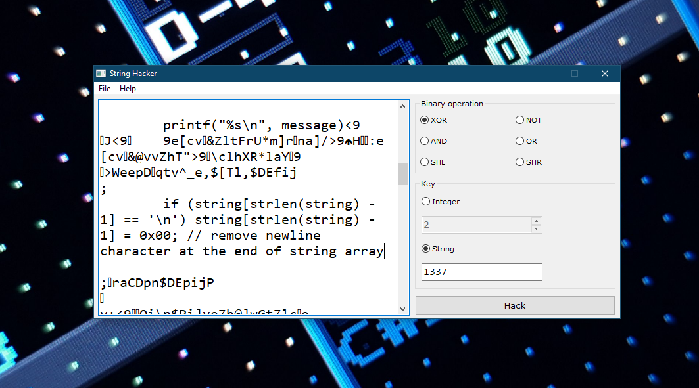

# String Hacker (StrHack)

### XOR encryptor lol

**\[[English](README.md) / [Русский](README-RU.md)\]**

---

**String Hacker** is a tiny cryptographic utility which encrypts text data using XOR and some other bitwise operations. Written by me just for fun. One of the most interesting... and useless projects I have ever been working on :)

String Hacker has been developed by me from January to June of 2022 year. The first version of String Hacker has been written by me in two evenings (really) and released on January, 3rd. String Hacker has been developed using Delphi 7, then rewritten in Visual C++ 9.0 (2008). Unfortunately, in May 2022 I have lost String Hacker `1.5` source codes, so in June 2022 I released `1.6L` version (`L` means legacy, based on `1.2` source codes which I found in my old backup) and stopped development completely.

String Hacker, originally developed as Freeware, is now licensed under the terms of [The Unlicense](UNLICENSE.txt). Free Pascal + Lazarus IDE is required for building the project.

